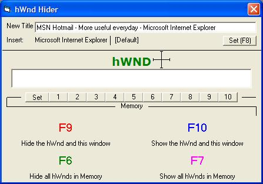



## \[\[ \* hWnd Hider \* \]\]

### Description

I made this to hide programs/windows that were currently open when my parents walked in. It has memory so you just press F6 to hide everything you have selected. Very useful for quickly hiding things.

There will be a new version comming out soon, with the following features: Hides a hWnd from Control Alt Delete when you choose to hide the window, cleaer code and new functions.
 
### More Info
 

             |
---                |---
**Submitted On**   |2004-07-10 20:44:38
**By**             |[The Lynxy](https://github.com/Planet-Source-Code/PSCIndex/blob/master/ByAuthor/the-lynxy.md)
**Level**          |Advanced
**User Rating**    |5.0 (50 globes from 10 users)
**Compatibility**  |VB 6\.0
**Category**       |[Miscellaneous](https://github.com/Planet-Source-Code/PSCIndex/blob/master/ByCategory/miscellaneous__1-1.md)
**World**          |[Visual Basic](https://github.com/Planet-Source-Code/PSCIndex/blob/master/ByWorld/visual-basic.md)
**Archive File**   |[\[\[\_\_\_hWnd\_1768167102004\.zip](https://github.com/Planet-Source-Code/the-lynxy-hwnd-hider__1-54867/archive/master.zip)

